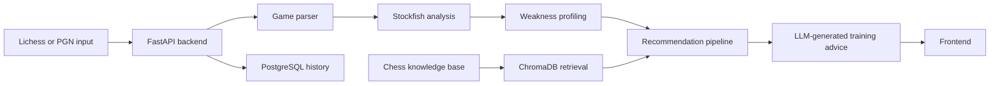

# Cerno

Cerno is an AI chess coach for Lichess players. It analyzes games, detects recurring weaknesses, retrieves relevant chess theory, and generates personalized training recommendations.

The goal of the project is to explore how chess engines, retrieval systems, and LLM-based reasoning can work together to turn raw chess games into practical training guidance.

This is a portfolio MVP, not a production SaaS.

## Why This Project

Most chess tools can show engine evaluations, but players still need to understand what those evaluations mean for their long-term improvement.

Cerno focuses on the layer between analysis and training:

- What kinds of mistakes appear repeatedly?
- Which positions or phases of the game are causing problems?
- What study material is relevant to those weaknesses?
- How can an AI assistant turn that information into a concrete training plan?

## Current Features

- Analyze Lichess games or manually provided PGN games
- Run engine analysis with Stockfish
- Parse and process games with python-chess
- Store analysis history with PostgreSQL
- Build a weakness profile from analyzed games
- Retrieve chess theory from a ChromaDB knowledge base
- Generate personalized training recommendations with an LLM
- Expose backend functionality through FastAPI endpoints
- Run the stack with Docker / Docker Compose
- Include tests for the current MVP behavior

The current RAG knowledge base includes 14 chess studies and 358 indexed chunks.

## Tech Stack

- Python
- FastAPI
- PostgreSQL
- ChromaDB
- Stockfish
- python-chess
- OpenAI API
- Docker / Docker Compose
- Next.js / React

## Architecture Overview

## Backend Scope

The backend currently includes endpoints for:

- Game analysis
- User history
- Weakness profile retrieval
- Training recommendations

The implementation is designed as an MVP that demonstrates practical backend and AI-system integration rather than production-scale infrastructure.

## What This Demonstrates

Cerno is meant to show:

- API design with FastAPI
- Integration between deterministic tools and LLM-based reasoning
- Use of a chess engine as a domain-specific analysis component
- Retrieval-augmented generation with ChromaDB
- Persistent storage with PostgreSQL
- Dockerized development workflow
- Product thinking around an AI-assisted training experience

## Roadmap

Possible next steps:

- Improve the weakness model with richer move and position features
- Expand the chess knowledge base
- Add clearer frontend views for analysis summaries and training plans
- Improve evaluation of recommendation quality
- Add authentication if the project evolves beyond local MVP usage

## Status

Cerno is an active portfolio project. The MVP backend is functional, dockerized, and tested, with ongoing work around product polish, frontend experience, and recommendation quality.
